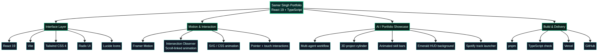

# Samar Singh — AI Engineer & Full-Stack Developer Portfolio

<div align="center">

[](https://www.typescriptlang.org/)
[](https://react.dev/)
[](https://vitejs.dev/)
[](https://tailwindcss.com/)
[](https://www.framer.com/motion/)
[](https://cloud.google.com/vertex-ai)
[](https://vercel.com/)

**Production-grade personal portfolio engineered with React 19, Vite, Tailwind CSS 4, and Framer Motion.**
Featuring immersive AI orchestration showcases, 3D project cylinders, interactive Omnitrix transformation flashes, and a live emerald HUD theme.

[Live Portfolio](https://samar-portfolio1.vercel.app) • [Report Bug](https://github.com/Samarssj/samar-portfolio1/issues) • [Request Feature](https://github.com/Samarssj/samar-portfolio1/issues)

</div>

---

## 🌟 Overview

This repository houses the personal portfolio website of **Samar Singh**, an AI Engineer and Full-Stack Developer specializing in autonomous agent orchestration, Generative AI solutions on Google Cloud Platform (GCP), and high-performance web applications.

The portfolio serves as an interactive experience designed from the ground up with fluid animations, mobile-first responsiveness, and an emerald dark-mode aesthetic.

---

## 🏗️ Technology Architecture & Stack Chart

The portfolio's component hierarchy, state flow, and technology distribution are structured across modular React subsystems:

<div align="center">
  
</div>

### 🛠️ Core Technology Stack

| Category | Technologies & Tools |
| :--- | :--- |
| **Frontend Framework** | `React 19`, `TypeScript`, `Wouter` (Client Routing) |
| **Styling & UI** | `Tailwind CSS 4`, `Radix UI Primitives`, `Lucide Icons`, Custom CSS Variables |
| **Animation & Motion** | `Framer Motion`, CSS Keyframes, Custom Scroll-Linked Intersection Observers |
| **AI & Cloud Ecosystem** | `Google Cloud Platform (GCP)`, `Vertex AI`, `Dialogflow CX`, `RAG & ChromaDB` |
| **Build & Tooling** | `Vite 7`, `pnpm`, `esbuild`, `TypeScript Compiler (tsc)`, `Prettier` |
| **Deployment** | `Vercel` (Automated CI/CD via GitHub) |

---

## ✨ Immersive Interactive Features

1. **Interactive Omnitrix Emblem**: Replaces standard branding with a slowly spinning green-and-black rotor (`OmnitrixEmblem.tsx`). Hovering glows the emerald core, and clicking triggers a full-screen energy flash animation (`omnitrix-transformation-flash`).
2. **AI Engineering Showcase Hub**: Central multi-agent orchestration diagram (`MultiAgentWorkflow.tsx`) surrounded by specialized AI and cloud capability panels. Features compact agent nodes and live packet-flow visualization.
3. **3D Project Cylinder**: Horizontal 3D cylinder that rotates smoothly as users scroll, showcasing enterprise AI chatbots, voice assistants, RAG intelligence platforms, and full-stack web applications.
4. **Scroll-Linked Experience Timeline**: Interactive professional history (EXL Service AI Engineer Intern to Associate Developer) connected by a green line animation that grows dynamically from bottom-to-top on scroll.
5. **Animated Skills Grid**: Card-based technical breakdown with animated emerald-to-cyan progress bars (0% to 80–97% target levels) triggered on viewport entry.
6. **Smooth Cursor Follower & Touch Support**: Custom glowing emerald cursor dot that tracks desktop pointers and maps touch interactions smoothly on mobile devices.
7. **Integrated Spotify Widget**: Collapsible mini player letting visitors listen to curated background tracks while browsing the portfolio.

---

## 🚀 Getting Started Locally

### Prerequisites
- **Node.js** (v18 or higher recommended)
- **pnpm** package manager (`npm install -g pnpm`)

### Installation & Development

1. Clone the repository:
   ```bash
   git clone https://github.com/Samarssj/samar-portfolio1.git
   cd samar-portfolio1
   ```

2. Install dependencies:
   ```bash
   pnpm install
   ```

3. Start the local development server:
   ```bash
   pnpm dev
   ```

4. Open [http://localhost:5173](http://localhost:5173) in your browser.

### Type Checking & Build
```bash
# Verify TypeScript types
pnpm check

# Production build test
pnpm build
```

---

## 📈 Portfolio Sections Summary

- **Hero Section**: Dynamic typing introduction, AI engineer credentials, direct resume link, and quick metrics (Internships, Projects, Certifications, AI Accuracy).
- **About Me**: Professional background in Generative AI, GCP deployment, and agentic workflows at EXL Service.
- **Skills & Expertise**: Categorized breakdown across Languages, Frameworks, AI & Cloud, Databases, Tools, and ML/Data with live animated percentage bars.
- **Featured Projects**: 3D cylinder and card navigation covering enterprise chatbots, voice assistants, RAG platforms, and full-stack web apps.
- **AI Engineering Showcase**: Deep-dive into Multi-Agent Orchestration, LLM Prompt Engineering, Tool Calling APIs, and Conversational AI Systems.
- **Certifications Gallery**: Professional credentials from Google Cloud, IBM, and Coursera.
- **Work Experience**: Chronological timeline from AI Engineering Intern to Associate Developer.
- **Contact Hub**: Direct messaging form and social connection channels.

---

## 👤 Author

**Samar Singh**
- AI Engineer & Full-Stack Developer
- GitHub: [@Samarssj](https://github.com/Samarssj)
- LinkedIn: [samarssj](https://www.linkedin.com/in/samarssj/)
- Email: [ssjsamar453@gmail.com](mailto:ssjsamar453@gmail.com)

---

## 📝 License

This project is open-source and available under the [MIT License](LICENSE).
